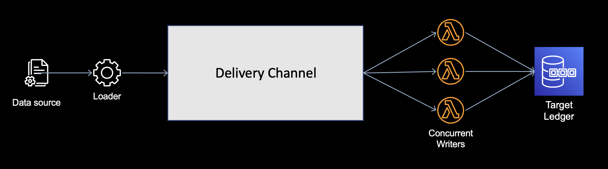
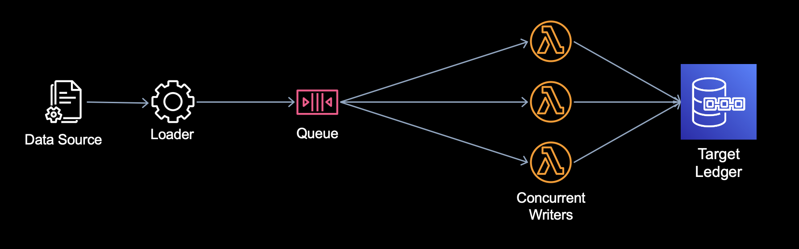
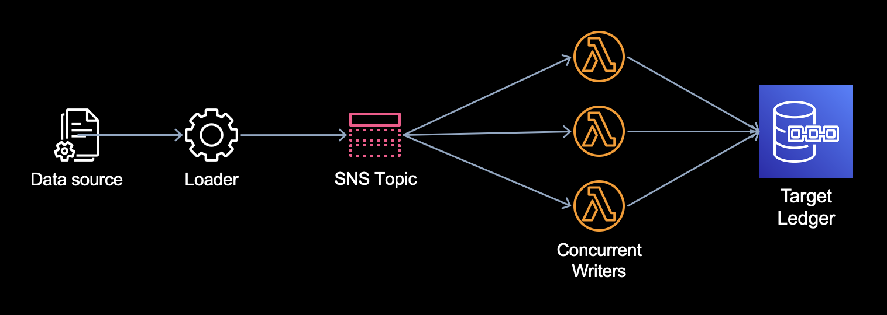
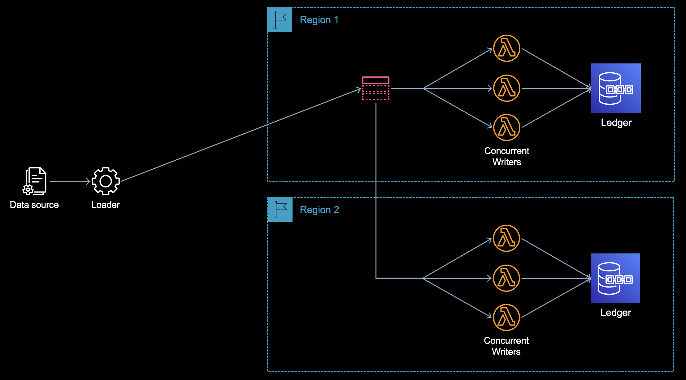
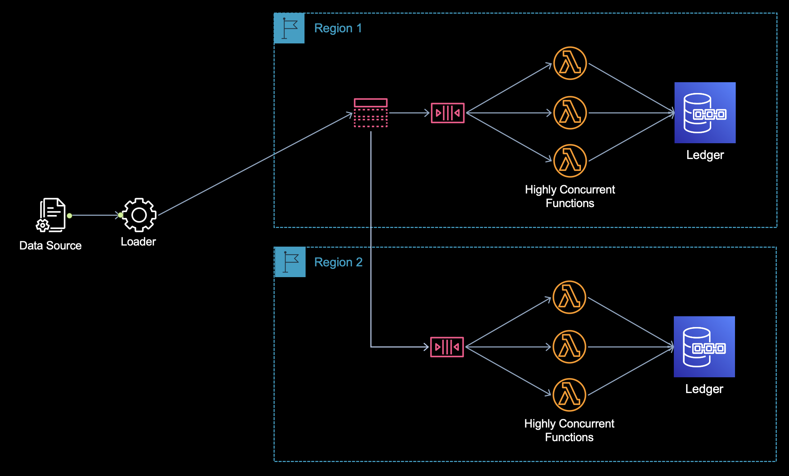
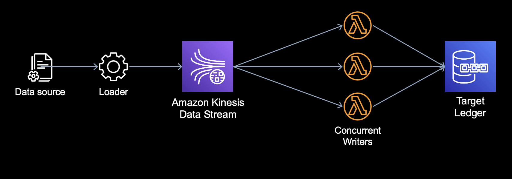
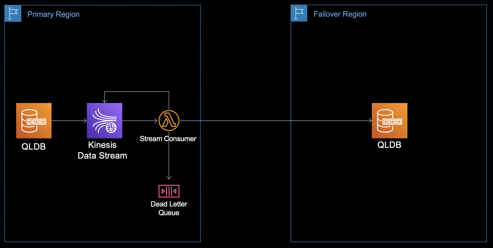
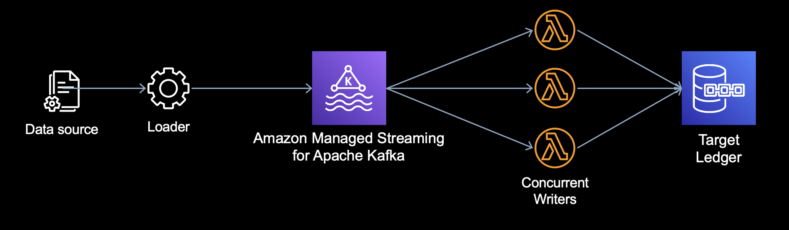
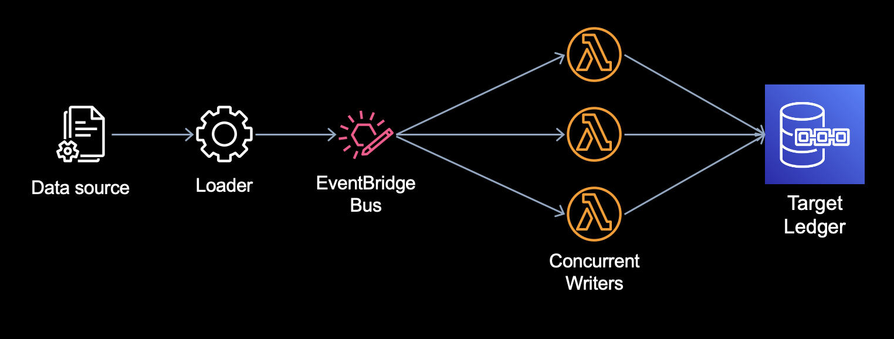
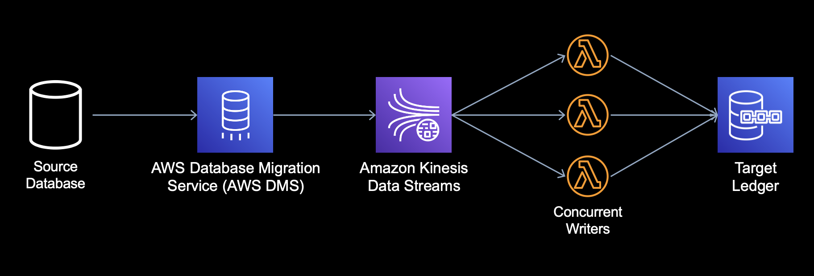

# Amazon QLDB Ledger Loader

This is a framework for asynchronous loading of data into an Amazon QLDB ledger.  The framework receives
events from a delivery channel and writes them to the target ledger, performing idempotency checks and 
ensuring that document revisions are written in order.  The supported delivery channels are listed below.  

Loader programs (not included in this project) read source data and write each record as an event into
the delivery channel in a specified message event format (see below).  The loader program is de-coupled
from the work of validating events and writing them to the ledger.  It simply needs to read data from the 
source as fast as it can and put events into the channel.



The project includes a default implementation that is useful for loading a [QLDB export](https://docs.aws.amazon.com/qldb/latest/developerguide/export-journal.html)
into a new ledger, but is easily extensible to suit other data loading scenarios, including ongoing cross-region
replication.  The qldb-export-processor project provides the loader program for loading exports.

### Event Format

The loader framework expects events as JSON or [Ion](https://amzn.github.io/ion-docs/) strings with the 
following fields:

| Field       | Required (Y/N) | Description                                                                                                                                                                                                                        |
|-------------|-------|------------------------------------------------------------------------------------------------------------------------------------------------------------------------------------------------------------------------------------|
| **op**      | Y     | Identifies the data load operation for this record.  Valid values are INSERT, UPDATE, DELETE, ANY. A value of ANY causes the framework to decide which operation is needed based on the event and the current state of the ledger. |
| **table**   | Y     | Identifies the table this record belongs to in the target ledger.                                                                                                                                                                  |
| **id**      | N     | The unique identifier for this record.  Used for idempotence checks.  If omitted, no idempotence check is conducted.                                                                                                               |
| **version** | N     | Identifies the sequential revision number of this record.  Used to ensure that revisions of documents are written in the correct order in the target ledger.  If omitted, no version check is conducted.                           |
| **data**    | N     | The document (record) to be written to the ledger.  Must be a JSON or Ion string.  If omitted, this event will be treated as a deletion.                                                                                           |

For example:

```json
{
  "op": "UPDATE",
  "table": "Person",
  "id": "JuvoLmXrENBEFUDWacVuOb",
  "version": 1,
  "data": {
    "FirstName": "Brent",
    "LastName": "Logan",
    "DOB": "1967-07-03",
    "GovId": "LOGANB486CG",
    "GovIdType": "Driver License",
    "Address": "43 Stockert Hollow Road, Everett, WA, 98203"
  }
} 
```

## Supported Delivery Channels

The following event delivery channels are supported.

### [Amazon SQS](https://docs.aws.amazon.com/AWSSimpleQueueService/latest/SQSDeveloperGuide/welcome.html)

Amazon SQS is useful for delivering events to a single destination.



### [Amazon SNS](https://docs.aws.amazon.com/sns/latest/dg/sns-getting-started.html)

Amazon SNS is useful for delivering events to multiple subscribers, even across regions.  If ordering
of events is required, use the Amazon SNS to Amazon SQS approach below.  AWS Lambda does not currently
support subscribing to an SNS FIFO topic, but it will subscribe to an SQS FIFO queue.

A Lambda function receives events from the SNS topic and loads the event into
the target ledger.  The Lambda service provides a limited number of event retries because it receives events from
SNS asynchronously.  Error-and-retry is the mechanism for preserving ordering of revisions of a document. Therefore, 
SNS should only be used as delivery channel for loads consisting of new records to deliver to the ledger, not for 
updates.  Otherwise, an excessive number of events may end up in the dead-letter queue.

Single-region approach:


Multi-region approach:


### Amazon SNS to Amazon SQS

Events can be written to an [Amazon SNS](https://docs.aws.amazon.com/sns/latest/dg/welcome.html) topic in a
fan-out architecture to distribute events to SQS queues in multiple regions to accomplish simultaneous 
multi-region writes. This is useful over a straight SNS-only fanout approach if FIFO is required because
Lambda does not currently subscribe to SNS FIFO topics but will subscribe to SQS FIFO queues.



### Amazon Kinesis

An Amazon Kinesis Data Stream can also be used as the delivery channel.



This framework can be used with [QLDB Streaming](https://docs.aws.amazon.com/qldb/latest/developerguide/streams.html)
to send data from one ledger to another.  For example, cross-region replication.



To use the framework to consume events from a QLDB stream, set the `LoaderHandlerName` parameter
in the CloudFormation stack to `software.amazon.qldb.load.receiver.QldbLedgerStreamEventReceiver::handleRequest`.

### Amazon Managed Streaming for Apache Kafka (MSK)



### Amazon EventBridge

This framework can be used with [Amazon EventBridge](https://docs.aws.amazon.com/eventbridge/latest/userguide/eb-what-is.html) as
the delivery channel.  A Lambda function receives events from an EventBridge bus rule and loads the event into
the target ledger.  The Lambda service provides a limited number of event retries because it receives events from
EventBridge asynchronously.  Error-and-retry is the mechanism for preserving ordering of revisions of a document.
Therefore, EventBridge should only be used as delivery channel for loads consisting of new records to deliver to the
ledger, not for updates.  Otherwise, an excessive number of events may end up in the dead-letter queue.



### AWS Database Migration Service (DMS)

This framework can be used with [AWS Database Migration Service (DMS)](https://docs.aws.amazon.com/dms/latest/userguide/Welcome.html)
to migrate data from a [DMS-supported source database](https://docs.aws.amazon.com/dms/latest/userguide/CHAP_Source.html)
into the target ledger via an Amazon Kinesis Data Stream as the delivery channel.  The framework supports both full loads and
Change Data Capture (CDC) to support one-time migrations, gradual cut-overs, or for on-going data replication from a source 
database into a QLDB ledger acting as an audit database.  DDL changes are not supported by the framework.



Understand how DMS works with your source database and with Kinesis Data Streams target endpoints before using this
approach.

It is possible to change the value of the primary key or unique identifier for a record in the source table.  To
propagate this change through to the ledger, the framework needs to know the previous value of the identifier.  To have
DMS provide the previous identifier, add the following configuration to the migration task's settings:

    "BeforeImageSettings": {
        "EnableBeforeImage": true,
        "ColumnFilter": "pk-only",
        "FieldName": "before-image"
    }

See [here](https://docs.aws.amazon.com/dms/latest/userguide/CHAP_Tasks.CustomizingTasks.TaskSettings.BeforeImage.html)
for more details on this setting.

## Requirements

1. **Sign up for AWS** &mdash; Before you begin, you need an AWS account. For more information about creating an AWS
   account and retrieving your AWS credentials, see [Accessing Amazon QLDB](https://docs.aws.amazon.com/qldb/latest/developerguide/accessing.html) in the Amazon QLDB Developer Guide.
2. **A QLDB ledger** &mdash; See [Basic operations for ledgers](https://docs.aws.amazon.com/qldb/latest/developerguide/ledger-management.basics.html#ledger-management.basics.create).
3. **An S3 bucket** &mdash; The bucket will be used to store code for deployment to Lambda.  See [Creating a bucket](https://docs.aws.amazon.com/AmazonS3/latest/userguide/create-bucket-overview.html).

## Setup

Build the project with the following command.

```bash
mvnw install
```

The build creates a JAR file in the `target` folder called `amazon-qldb-ledger-load-VERSION-deploy-pkg.jar`. Upload
the file to an S3 bucket, where it will be used by one of the CloudFormation templates below.

Deploy the loader project by creating a stack with one of the templates in the `src/main/cfn` folder of the project.  Select
one of the following:

| Template                             | Description        |
|--------------------------------------|--------------------|
| qldb-ledger-load-via-sqs.yml         | SQS                |
| qldb-ledger-load-via-sns.yml         | SNS                |
| qldb-ledger-load-via-sns-to-sqs.yml  | SNS to SQS         | 
| qldb-ledger-load-via-kinesis.yml     | Kinesis            |
| qldb-ledger-load-via-msk.yml         | MSK                |
| qldb-ledger-load-via-eventbridge.yml | Amazon EventBridge |
| qldb-ledger-load-via-dms-kinesis.yml | DMS                |

## Configuration

The CloudFormation templates each contain configuration parameters with a short description.  Some parameters require
more explanation and are described here.

### Strict Mode (LoaderStrictMode)

Strict mode determines the validation behavior of the RevisionWriter in certain circumstances.  When strict mode is on,
validation will fail DELETE and UPDATE events if the corresponding record does not exist in the target ledger.  When
strict mode is off, these events will be quietly skipped.  Strict mode is useful when the target ledger is expected to
be in a perfect replicated state.  Turning strict mode off provides flexibility and can be useful to repair a target ledger
when replication is interrupted unexpectedly.

### LambdaCodeS3Key and LambdaCodeS3Bucket

Maven creates a deployment file called amazon-qldb-ledger-load-[VERSION]-deploy-pkg.jar.  This jar contains the code
from this project and its dependencies and is suitable for Lambda function deployments.  After building the project,
this file should be uploaded to an Amazon S3 bucket in your account.  The LambdaCodeS3Key and LambdaCodeS3Bucket
configuration parameters tell the CloudFormation template where the deployment package is in S3 when creating the Lambda
functions.  LambdaCodeS3Key specifies the "path" of the deployment package relative to the root of bucket. For example,
"projects/code/qldb/amazon-qldb-ledger-load-[VERSION]-deploy-pkg.jar".

### RevisionWriterClass

Specifies the fully-qualified class name of the RevisionWriter that the loader Lambda function (event handler) uses to
interact with the ledger(s).  Implementations must be sub-classes of software.amazon.qldb.load.writer.RevisionWriter.  The
project currently provides two RevisionWriter implementations: BaseRevisionWriter and TableMapperRevisionWriter.  You may
create your own if these don't provide the functionality you need.

### LoaderProvisionedConcurrency

The project uses [Lambda provisioned concurrency](https://docs.aws.amazon.com/lambda/latest/dg/provisioned-concurrency.html)
to reserve a baseline set of Lambda resources to apply to ledger loading.  QLDB ledger throughput depends on the number
of clients -- more writers yield higher throughput (up to a point).  However, provisioned concurrency can be expensive.
This parameter allows you to set the minimum provisioned capacity for loading and control costs.  The project should be
undeployed when no longer needed to reduce costs.

### MaxOccRetries

The QLDB drivers will automatically retry transactions up to 4 times when [OCC conflicts](https://docs.aws.amazon.com/qldb/latest/developerguide/concurrency.html)
are encountered.  You can override this behavior with this parameter.  In general, it's best to leave this at its
default setting.

### MaxLedgerSessionsPerLambda

Determines the number of concurrent ledger sessions each instance of the QLDB driver can consume.  The default for this is
1, which means 1 session per Lambda instance.  Leave this setting at its default unless your specific implementation
requires more.

## Getting Help

Please use these community resources for getting help.
* Ask a question on StackOverflow and tag it with the [amazon-qldb](https://stackoverflow.com/questions/tagged/amazon-qldb) tag.
* Open a support ticket with [AWS Support](http://docs.aws.amazon.com/awssupport/latest/user/getting-started.html).
* Make a new thread at [AWS QLDB Forum](https://forums.aws.amazon.com/forum.jspa?forumID=353&start=0).
* If you think you may have found a bug, please open an issue.

## License

This library is licensed under the MIT-0 license.